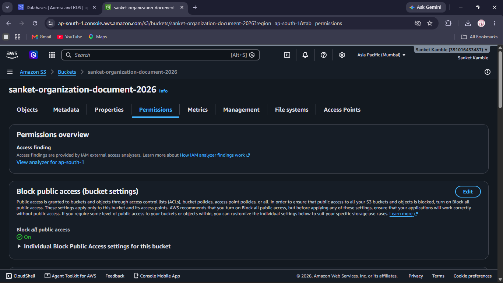

# AWS S3 Document Storage System

## AWS Project Assignment – Set 6 – Question 2

An Amazon S3-based document storage system for an organization. The project demonstrates organized document storage using folders, controlled bucket access, S3 Versioning, and recovery of an earlier version of a file.

---

## 1. Project Objective

The objective of this project is to demonstrate:

- Amazon S3 document storage
- Organized folders for different departments/projects
- Secure bucket access configuration
- Block Public Access
- IAM-based permissions
- S3 Versioning
- Creation of multiple versions of the same object
- Recovery of an earlier object version

---

## 2. AWS Region

```text
Region: Asia Pacific (Mumbai)
Region Code: ap-south-1
```

---

## 3. S3 Bucket

```text
Bucket Name: sanket-organization-document-2026
Region: ap-south-1
```

The bucket is used as the organization's document storage location.

---

## 4. Bucket Security

### Block Public Access

The bucket has **Block all public access enabled**.

This prevents the documents from being exposed through public bucket/object access unless the configuration is intentionally changed.



---

## 5. Document Organization

Documents are organized using S3 prefixes/folders for different organizational areas.

The demonstrated structure includes:

```text
sanket-organization-document-2026/
│
├── HR/
│   └── employee-policy.txt
│
├── Finance/
│   └── salary-report.txt
│
└── Projects/
    └── AWS Project.txt
```

### HR Folder

The HR folder contains:

```text
employee-policy.txt
```


### Finance Folder

The Finance folder contains:

```text
salary-report.txt
```


### Projects Folder

The Projects folder contains:

```text
AWS Project.txt
```


---

## 6. IAM Access Policy

A customer-managed IAM policy named:

```text
OrganizationS3DocumentAccess
```

was created for controlled access to the S3 document storage.

The policy provides limited S3 list/read/write access rather than making the bucket public.


### Intended permissions

```text
s3:ListBucket
s3:GetObject
s3:PutObject
s3:DeleteObject
```

The permissions are intended to be scoped to the organization document bucket and its objects.

---

## 7. S3 Versioning

Bucket Versioning is enabled.

```text
Bucket Versioning: Enabled
MFA Delete: Disabled
```

Versioning allows multiple variants of the same object to be retained.


---

## 8. Versioning Demonstration

The file:

```text
Projects/AWS Project.txt
```

was used to demonstrate version control.

### Version 1

The original file contained:

```text
AWS Project Documentation - Version 1
Two-tier AWS application project.
```

The file was then updated and uploaded again with the same object name, creating a new object version.

### Version History

Conceptually, the object history is:

```text
AWS Project.txt
│
├── Current Version
└── Earlier Version
```

S3 Versioning preserves the earlier version instead of permanently losing it when the object is overwritten.

---

## 9. Earlier Version Recovery

The earlier version of the project document was recovered/downloaded successfully.

Recovered content:

```text
AWS Project Documentation - Version 1
Two-tier AWS application project.
```


This demonstrates the required recovery of an earlier S3 object version.

---

## 10. Testing Results

| Test | Result |
|---|---|
| S3 bucket created | PASS |
| Bucket in Mumbai region | PASS |
| Public access blocked | PASS |
| HR folder created | PASS |
| Finance folder created | PASS |
| Projects folder created | PASS |
| Documents uploaded | PASS |
| IAM S3 access policy created | PASS |
| Versioning enabled | PASS |
| Multiple versions demonstrated | PASS |
| Earlier version recovered | PASS |

---

## 11. Evidence Screenshots

The repository contains the following evidence:

| Screenshot | Evidence |
|---|---|
| `screenshots/s3-permissions.png` | S3 Block Public Access |
| `screenshots/hr-folder.png` | HR folder and document |
| `screenshots/finance-folder.png` | Finance folder and document |
| `screenshots/projects-folder.png` | Projects folder and document |
| `screenshots/iam-policy.png` | IAM S3 document access policy |
| `screenshots/versioning.png` | S3 Versioning enabled |
| `screenshots/recovered-version.png` | Earlier version recovered |

---

## 12. Security Design

The storage system follows these principles:

```text
Internet
   X
   |
   X  Public S3 access blocked
   |
Authorized AWS identity
   |
   v
IAM permissions
   |
   v
S3 Bucket
   |
   +-- HR/
   +-- Finance/
   +-- Projects/
```

The bucket is kept private and access is controlled through AWS IAM rather than public access.

---

## 13. Implementation Steps

```text
1. Create S3 bucket
        ↓
2. Select Mumbai region
        ↓
3. Keep Block Public Access enabled
        ↓
4. Enable Bucket Versioning
        ↓
5. Create HR, Finance and Projects folders
        ↓
6. Upload organizational documents
        ↓
7. Create IAM S3 access policy
        ↓
8. Update the same file to create a new version
        ↓
9. Show version history
        ↓
10. Recover/download the earlier version
```

---

## 14. Sample Documents

The demonstrated documents are sample text files created for the project:

```text
HR/employee-policy.txt
Finance/salary-report.txt
Projects/AWS Project.txt
```

No confidential organizational documents are required for this demonstration.

---

## 15. Final Result

The S3 document storage system successfully demonstrates all core requirements:

```text
S3 Bucket
   |
   +-- Organized folders
   |      +-- HR
   |      +-- Finance
   |      +-- Projects
   |
   +-- Secure access
   |      +-- Block Public Access
   |      +-- IAM Policy
   |
   +-- Versioning
          +-- Multiple versions
          +-- Earlier version recovery
```

---

## Author

**Sanket Kamble**

```text
AWS | Amazon S3 | IAM | Cloud Security
```
